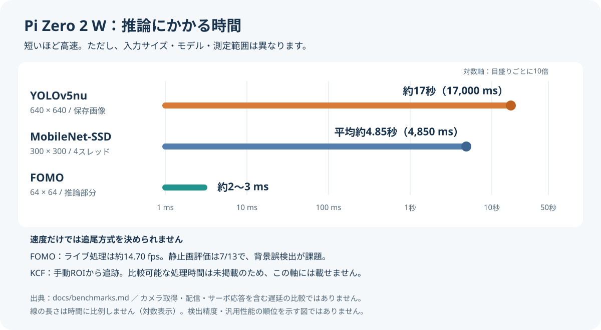
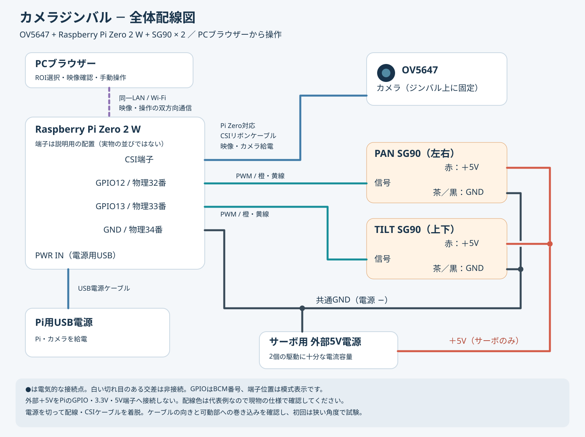

# Raspberry Pi Camera SG90 Gimbal Tracker

PCブラウザーで対象を選び、Raspberry Pi Zero 2 W上で追跡し、SG90サーボ2個でカメラの向きを調整する実験プロジェクトです。OV5647カメラの配信・手動操作から、物体検出の性能比較、KCF追跡までをまとめています。


[部品表](BOM.md) · [セットアップ](docs/setup.md) · [安全上の注意](SAFETY.md) · [ベンチマーク詳細](docs/benchmarks.md)

> このプロジェクトは実験段階です。人物を自動検知して安定して追い続ける完成品ではありません。

## KCF追跡の構成とデモ

PCブラウザーで対象領域（ROI）を選び、Pi Zero 2 W上のOpenCV KCFで追跡します。YOLOによる自動検出は使わず、追跡中心と映像中心の差からSG90を制御する構成です。

| 役割 | 構成 |
|---|---|
| 対象選択・映像確認 | 同じネットワークのPCブラウザーからROIを選択、MJPEG映像・状態を確認 |
| 映像取得・追跡 | OV5647（CSI接続）とPi Zero 2 W、OpenCV KCF |
| カメラの向き調整 | SG90 × 2、PANはGPIO12（物理32番）、TILTはGPIO13（物理33番） |
| サーボ給電 | 外部5V電源。外部電源GNDとPi GNDを共通化 |

概要図は信号の流れを示す概念図です。実際の配線や可動範囲は[安全上の注意](SAFETY.md)と[セットアップ](docs/setup.md)を確認してください。

パン・チルト機構には、MakerWorldの[SG90 Servo 2 Axis Gimbal](https://makerworld.com/ja/models/511916-sg90-servo-2-axis-gimbal)を3Dプリントして使用しています。モデルの作者名、ライセンス、利用条件は公開時にMakerWorld掲載ページで再確認してください。このリポジトリにはモデル本体や派生データを含めず、ライセンスも付与しません。

### ブラウザーでROIを選ぶデモ

[](https://www.youtube.com/watch?v=6AgrW0ljx98)

### ジンバルが追従するデモ

[](https://www.youtube.com/watch?v=jf3r5UFmqSM)

サムネイルをクリックするとYouTubeで再生します。原動画は[Release v0.1.0-kcf-demo](https://github.com/zorosdrone/pi-zero-camera-gimbal-tracker/releases/tag/v0.1.0-kcf-demo)からもダウンロードできます。

## 処理時間と方式選定

Pi Zero 2 W実機で測定した結果です。重い検出モデルは処理時間が長く、軽量なFOMOは速度面では候補ですが、背景誤検出が課題でした。そこで、対象の指定を人が行うKCF方式で追跡とジンバル制御を検証しています。



| 方式・処理 | 実測の概要 | このプロジェクトでの判断 |
|---|---|---|
| YOLOv5nu / OpenCV DNN | 640×640、保存画像で約17秒。カメラ入力では約0.052 fps | リアルタイム追跡には速度不足 |
| MobileNet-SSD / OpenCV DNN | 300×300、4スレッド、平均約4.85秒（約0.206 fps） | リアルタイム追跡には速度不足 |
| Edge Impulse FOMO | 64×64、推論約2〜3 ms。ライブ処理は約14.70 fps | 速度は候補。静止画評価は画像単位7/13で、再学習が必要 |
| KCF | ROI選択・追跡・サーボ指令の基本動作を確認 | 実環境評価を継続。比較可能な処理時間は未掲載 |
| カメラ取得 / MJPEG配信 | 取得約14.98 fps、配信中CPU約12.4% | 映像入出力の確認値。推論性能とは別指標 |

入力解像度・モデル・前処理が異なるため、同一条件での性能順位ではありません。FOMOの推論時間は映像取得からサーボ応答までの遅延ではなく、fpsと単純に置き換えることもできません。測定条件と判断の詳細は[ベンチマーク結果](docs/benchmarks.md)を参照してください。

## 実機の構成

### 全体の配線



OV5647はPi Zero対応のCSIリボンケーブルでPiに接続し、PCは同じネットワークからWi-Fi経由で操作します。Piは電源用USB端子（PWR IN）から給電し、サーボ2個は外部5V電源で別給電します。

図は接続先の模式図で、実物のピン配置図ではありません。GPIO番号はBCM方式です。PAN信号はGPIO12（物理32番）、TILT信号はGPIO13（物理33番）へ接続します。外部電源GND・サーボ2個のGND・Pi GND（物理34番）は共通接続します。サーボ端子の対応だけ確認する場合は[サーボ配線対応図](assets/05_SG90_配線イラスト.svg)も参照できます。配線前に[安全上の注意](SAFETY.md)を確認してください。

### 組み立て例


## 現在の状態

| 機能 | 状態 |
|---|---|
| OV5647静止画・デュアルストリーム取得 | 実機確認済み |
| MJPEG・H.264配信 | 実機確認済み |
| SG90 2軸の安全範囲試験 | 実機確認済み |
| ブラウザーからの手動ジンバル操作 | 実機確認済み |
| PCブラウザーでROIを選ぶKCF追跡 | 基本動作確認済み、実環境評価は継続 |
| YOLO/OpenCV DNN | Pi Zero 2 Wでは速度不足 |
| MobileNet-SSD/OpenCV DNN | Pi Zero 2 Wでは速度不足 |
| Edge Impulse FOMO | 速度は実用候補、背景誤検出が多い |
| 完全自動人物追尾 | 未完成 |

## 最初に試す構成

現在もっとも再現しやすい入口は、カメラ映像をブラウザーへ配信し、手動でジンバルを動かす構成です。セットアップ後、リポジトリのルートで実行します。

```bash
python3 src/05_manual_gimbal_web_control.py
```

同じネットワークのPCから次を開きます。

```text
http://raspberrypi.local:8000/
```

配線前に[安全上の注意](SAFETY.md)を読み、[部品表](BOM.md)と[セットアップ手順](docs/setup.md)を確認してください。

## 実験フォルダ

- `experiments/edge-impulse-fomo/`: FOMOのカメラ・静止画推論
- `experiments/opencv-dnn/`: YOLO、MobileNet-SSDのCPU性能比較
- `experiments/kcf-tracking/`: ブラウザーROI選択、KCF追跡、サーボ制御

測定条件と結果は[ベンチマーク結果](docs/benchmarks.md)へまとめています。

## ライセンス

- `src/`、`experiments/`、`scripts/` の自作コード: [MIT License](LICENSE)
- 自作の文書、図、写真、およびGitHub Releaseに添付する自作デモ動画: [CC BY 4.0](LICENSE-DOCUMENTATION.md)
- Picamera2由来の部分、依存パッケージ、外部3Dモデル、同梱していない素材: [NOTICE.md](NOTICE.md) を参照
