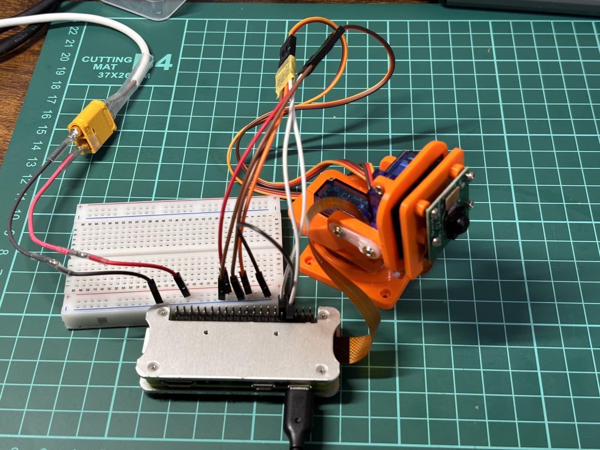
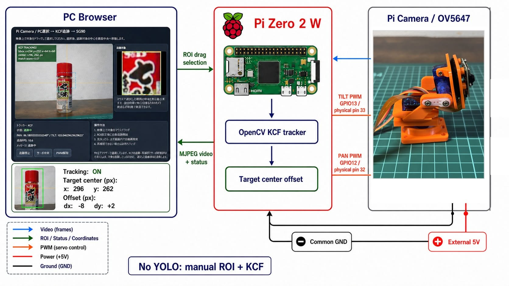

# Raspberry Pi Camera SG90 Gimbal Tracker

Raspberry Pi Zero 2 W、OV5647カメラ、SG90サーボ2個を使ったパン・チルトジンバルの実験プロジェクトです。カメラ配信、手動操作、物体検知、KCF追跡を段階的に検証しています。



> このプロジェクトは実験段階です。人物を自動検知して安定して追い続ける完成品ではありません。

## KCF追跡の構成とデモ



PCブラウザーで対象領域（ROI）を選び、Pi Zero 2 W上のOpenCV KCFで追跡します。YOLOによる自動検出は使わず、追跡中心と映像中心の差からSG90を制御する構成です。

パン・チルト機構には、MakerWorldの[SG90 Servo 2 Axis Gimbal](https://makerworld.com/ja/models/511916-sg90-servo-2-axis-gimbal)を3Dプリントして使用しています。モデルの作者名、ライセンス、利用条件は公開時にMakerWorld掲載ページで再確認してください。このリポジトリにはモデル本体や派生データを含めず、ライセンスも付与しません。

### ブラウザーでROIを選ぶデモ

[](https://www.youtube.com/watch?v=6AgrW0ljx98)

### ジンバルが追従するデモ

[](https://www.youtube.com/watch?v=jf3r5UFmqSM)

サムネイルをクリックするとYouTubeで再生します。動画はGit履歴へ含めず、原動画は[Release v0.1.0-kcf-demo](https://github.com/zorosdrone/pi-zero-camera-gimbal-tracker/releases/tag/v0.1.0-kcf-demo)の添付ファイルとしても配布します。

## 現在の状態

| 機能 | 状態 |
|---|---|
| OV5647静止画・デュアルストリーム取得 | 実機確認済み |
| MJPEG・H.264配信 | 実機確認済み |
| SG90 2軸の安全範囲試験 | 実機確認済み |
| ブラウザーからの手動ジンバル操作 | 実機確認済み |
| PCブラウザーでROIを選ぶKCF追跡 | 基本動作確認済み、実環境評価は継続 |
| YOLO/OpenCV DNN | Pi Zero 2 Wでは速度不足 |
| MobileNet-SSD/OpenCV DNN | Pi Zero 2 Wでは速度不足 |
| Edge Impulse FOMO | 速度は実用候補、背景誤検出が多い |
| 完全自動人物追尾 | 未完成 |

## 最初に試す構成

現在もっとも再現しやすい入口は、カメラ映像をブラウザーへ配信し、手動でジンバルを動かす構成です。

```bash
python3 src/05_manual_gimbal_web_control.py
```

同じネットワークのPCから次を開きます。

```text
http://raspberrypi.local:8000/
```

配線前に[安全上の注意](SAFETY.md)を読み、[部品表](BOM.md)と[セットアップ手順](docs/setup.md)を確認してください。

## 実験フォルダ

- `experiments/edge-impulse-fomo/`: FOMOのカメラ・静止画推論
- `experiments/opencv-dnn/`: YOLO、MobileNet-SSDのCPU性能比較
- `experiments/kcf-tracking/`: ブラウザーROI選択、KCF追跡、サーボ制御

測定条件と結果は[ベンチマーク結果](docs/benchmarks.md)へまとめています。

## 公開対象外

初回版には学習・推論モデル、人物サンプル画像、商品ページ画像、室内メモが写った試写、既存動画を含めません。モデルは利用者自身が正規の配布元から取得・生成する前提です。

新しいデモ動画は後から`media/`またはGitHub Releasesへ追加します。

## 公開準備状態

コードと公開用文書を独立Git履歴として整理し、私有GitHubリポジトリへ反映済みです。公開前に実機・動画・外部素材の最終確認を行います。

## ライセンス

- `src/`、`experiments/`、`scripts/` の自作コード: [MIT License](LICENSE)
- 自作の文書、図、写真、およびGitHub Releaseに添付する自作デモ動画: [CC BY 4.0](LICENSE-DOCUMENTATION.md)
- Picamera2由来の部分、依存パッケージ、外部3Dモデル、公開対象外素材: [NOTICE.md](NOTICE.md) を参照
